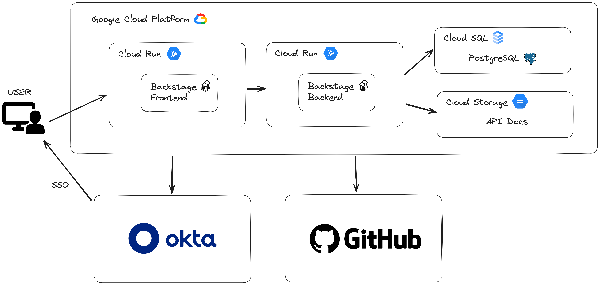

# Implementation

In this section, we will delve into an example implementation of Backstage using a combination of Google Cloud Platform (GCP) services, Okta for Single Sign-On (SSO) authentication and authorization, and GitHub integration to access organization data.

Here's a preliminary glimpse into the system's structure:

<figure><figcaption>
Backstage System Design
</figcaption></figure>

### Backend and Frontend Deployment on GCP Cloud Run

#### Backend Deployment

We chose to deploy our Backstage backend on Google Cloud Run due to its simplicity and scalability. Here's how we did it:

1. **Containerization**: We containerized our Backstage backend using Docker, ensuring that all dependencies and configurations were encapsulated.
2. **Google Cloud Build**: We set up a Cloud Build pipeline to automatically build and push the Docker image to Google Container Registry (GCR) whenever changes were pushed to our source repository.
3. **Google Cloud Run**: We deployed the Docker image on Google Cloud Run, enabling serverless execution and easy scalability. The serverless nature of Cloud Run allowed us to focus on the application code without worrying about server management.

#### Frontend Deployment

Our Backstage frontend was also deployed on Google Cloud Run, following a similar process:

1. **Static Site Generation**: We generated a static build of the Backstage frontend using the appropriate tooling.
2. **Google Cloud Build**: Similar to the backend, we set up a Cloud Build pipeline to build the frontend and push it to GCR.
3. **Google Cloud Run**: We deployed the static frontend to Google Cloud Run, benefitting from its serverless nature and global distribution for low-latency access.

### Database Management with GCP Cloud SQL

For managing our database, we opted for Google Cloud SQL. Here's how we integrated it:

1. **Database Setup**: We created a Cloud SQL instance and configured it according to our database requirements, choosing PostgreSQL as the database engine.
2. **Connection Pooling**: To enhance performance and manage database connections efficiently, we implemented connection pooling within our Backstage backend, ensuring a smooth user experience.

### Okta for SSO Authentication and Authorization

To implement robust authentication and authorization, we integrated Okta with our Backstage instance:

1. **Okta Setup**: We configured an Okta application to serve as the identity provider for Backstage.
2. **SSO Integration**: Through the Okta application, we enabled Single Sign-On (SSO) for Backstage, ensuring that users could authenticate using their Okta credentials.
3. **Authorization Policies**: We defined authorization policies within Okta to control access to different parts of Backstage based on user roles and permissions.

### GitHub Integration for Organization Data

GitHub integration was crucial for accessing and managing our organization's data within Backstage:

1. **GitHub OAuth**: We set up OAuth integration with GitHub, allowing Backstage to securely authenticate with GitHub on behalf of users.
2. **GitHub Metadata**: Backstage automatically pulls in organization data, including repositories, teams, and contributors, using the GitHub API. This data enriches the developer portal, providing valuable insights and context.

### Cloud Storage for Storing API Docs

To store and manage API documentation, we utilized Google Cloud Storage:

1. **Storage Buckets**: We created Google Cloud Storage buckets to store API documentation files securely.
2. **Integration**: Backstage was configured to access and serve API documentation from these storage buckets, ensuring versioned and reliable access to documentation resources.

By implementing this combination of GCP services, Okta for authentication, and GitHub integration, we've created a robust Backstage setup that efficiently manages developer resources and provides a seamless experience for our users. Additionally, using Cloud Storage for API documentation storage ensures that our documentation remains accessible, scalable, and highly available.
